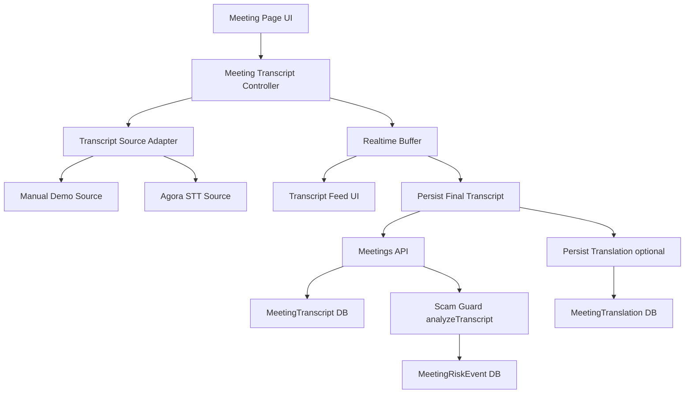
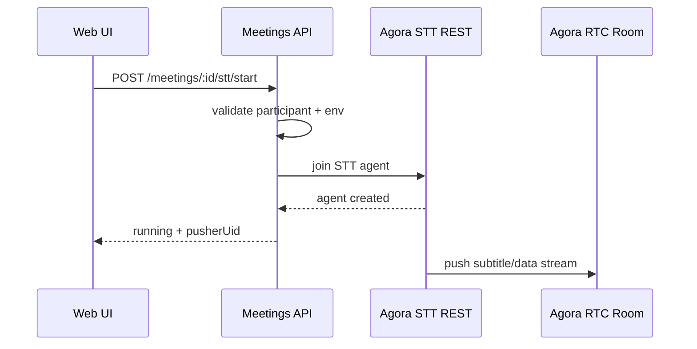
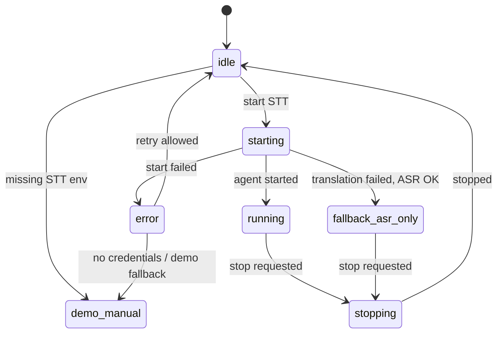

# Meeting Realtime ASR Module Design

## Bối cảnh

Thiết kế này dựa trên:

- plan active: [process/general-plans/active/demo-completion_20-06-26/demo-completion_PLAN_20-06-26.md](/D:/AI_LABs/TrustRoomAI/process/general-plans/active/demo-completion_20-06-26/demo-completion_PLAN_20-06-26.md)
- hệ thống tổng thể: [trustroom_ai_system_design.md](/D:/AI_LABs/TrustRoomAI/trustroom_ai_system_design.md)
- hiện trạng code meeting module trong `apps/api` và `apps/web`

Mục tiêu của tài liệu này là thiết kế **module Realtime ASR cho Meeting Room** sao cho:

1. chạy được trong demo mode theo plan hiện tại
2. nâng cấp mượt sang Agora STT thật khi env đầy đủ
3. không phá vỡ luồng transcript, risk detection và evidence đang có

---

## Nguyên tắc thiết kế

Thiết kế module này bám 4 nguyên tắc:

1. **Env-driven**
   - Có key/credential thì chạy Agora STT thật
   - Thiếu credential thì rơi về manual/demo transcript mode, không crash

2. **Transcript-first**
   - Giá trị cốt lõi của module là transcript realtime
   - Translation là lớp tăng cường, không phải dependency bắt buộc

3. **Final transcript mới persist**
   - Partial transcript chỉ dùng cho UI realtime
   - Transcript final mới ghi DB và chạy Scam Guard

4. **Demo-compatible, production-upgradable**
   - Cùng một UI transcript block
   - Cùng một pipeline persist/risk
   - Chỉ thay nguồn input: manual/demo hoặc Agora STT thật

---

## Mục tiêu module

Module này chịu trách nhiệm:

- bật/tắt realtime transcript cho một meeting
- nhận transcript realtime từ nguồn phù hợp
- hiển thị transcript trực tiếp trên web
- persist transcript final
- persist translation nếu có
- kích hoạt pipeline Scam Guard từ transcript final

Module này không chịu trách nhiệm:

- full speech-to-speech dubbing
- live TTS output
- cloud recording
- arbitration logic
- full AI observer agent behavior

---

## Vị trí trong plan

Thiết kế này bám đúng tinh thần plan active:

- Plan hiện tại yêu cầu hệ thống **demo-able end-to-end**
- Nếu thiếu Agora key thì deal room vẫn phải chạy bằng placeholder/manual transcript composer
- Khi có key thì tự nâng cấp lên call room + transcript thật

Suy ra:

- module ASR không được thiết kế theo kiểu “có Agora mới chạy”
- module phải có **hai mode vận hành**

### Hai mode chính

1. `demo/manual mode`
   - user hoặc hệ thống nhập transcript thủ công
   - dùng cho môi trường chưa đủ Agora STT credentials

2. `agora realtime mode`
   - Agora RTC room phát audio/video thật
   - Agora STT agent trả subtitle realtime
   - UI hiển thị transcript trực tiếp

---

## Ranh giới module



---

## Kiến trúc module

Module nên chia thành 5 phần:

## 1. Transcript Source Layer

Lớp này trừu tượng hóa nguồn transcript.

### Nhiệm vụ

- cung cấp transcript chunk theo interface thống nhất
- che giấu khác biệt giữa manual input và Agora STT

### Hai source

- `ManualTranscriptSource`
- `AgoraRealtimeTranscriptSource`

### Interface đề xuất

```ts
interface RealtimeTranscriptSource {
  start(): Promise<void>;
  stop(): Promise<void>;
  getState(): TranscriptSourceState;
  onChunk(cb: (chunk: RealtimeTranscriptChunk) => void): void;
  onError(cb: (error: Error) => void): void;
}
```

Ý nghĩa:

- UI không phụ thuộc trực tiếp vào Agora internals
- sau này có thể thay nguồn bằng provider khác

## 2. Realtime Buffer Layer

Lớp gom transcript realtime trước khi persist.

### Nhiệm vụ

- giữ partial transcript đang chạy
- cập nhật entry khi có chunk mới
- đánh dấu final
- chống duplicate

### Vì sao bắt buộc cần lớp này

Agora subtitle thường không đi vào DB theo đúng shape cuối cùng ngay lập tức. Nếu ghi DB từng chunk sẽ:

- làm feed bị nhiễu
- tăng duplicate
- tăng false positive cho Scam Guard

## 3. Persistence Layer

Lớp này quyết định khi nào transcript được lưu.

### Nhiệm vụ

- nhận final transcript từ buffer
- gọi API lưu `MeetingTranscript`
- nếu có translation thì lưu `MeetingTranslation`
- invalidate/refetch feed liên quan

## 4. Risk Hook Layer

Thực tế hiện nay risk được sinh ở backend khi add transcript.

Thiết kế module nên tiếp tục tận dụng điều này:

- frontend không tự chạy Scam Guard
- frontend chỉ đẩy final transcript
- backend là nơi chuẩn hóa và sinh risk events

## 5. Status + UX Layer

Lớp này chịu trách nhiệm trạng thái hiển thị.

### Trạng thái đề xuất

- `idle`
- `demo_manual`
- `starting`
- `running`
- `fallback_asr_only`
- `stopping`
- `error`

Ý nghĩa:

- `demo_manual`: chưa có Agora STT thật, nhưng transcript flow vẫn usable
- `fallback_asr_only`: Agora STT có chạy nhưng translation không hoạt động

---

## Thiết kế dữ liệu nội bộ

## 1. Chunk realtime chuẩn hóa

```ts
interface RealtimeTranscriptChunk {
  chunkId: string;
  source: 'manual' | 'agora';
  meetingId: string;
  speakerUid?: string | number | null;
  speakerLabel: string;
  text: string;
  language: string;
  translatedText?: string | null;
  targetLanguage?: string | null;
  confidence?: number | null;
  startTime?: number | null;
  endTime?: number | null;
  isPartial: boolean;
  isFinal: boolean;
  receivedAt: number;
}
```

### Mục đích

- manual transcript và agora transcript cùng dùng chung một shape
- UI transcript block không cần biết nguồn vào

## 2. Entry trong buffer

```ts
interface BufferedTranscriptEntry {
  entryId: string;
  dedupeKey: string;
  chunkId?: string;
  speakerUid?: string | number | null;
  speakerLabel: string;
  text: string;
  language: string;
  translatedText?: string | null;
  targetLanguage?: string | null;
  startTime?: number | null;
  endTime?: number | null;
  isFinal: boolean;
  updatedAt: number;
}
```

## 3. STT trạng thái backend

```ts
interface MeetingSttState {
  enabled: boolean;
  mode: 'demo_manual' | 'asr_only' | 'asr_translate';
  status: 'idle' | 'starting' | 'running' | 'fallback_asr_only' | 'stopping' | 'error';
  agentId: string | null;
  pusherUid: number | null;
  languages: string[];
  targetLanguages: string[];
  fallbackReason?: string | null;
}
```

---

## Thiết kế backend module

## 1. Vai trò backend

Backend module này có 4 trách nhiệm:

1. preflight check credential
2. start/stop/query Agora STT agent
3. persist transcript/translation
4. nối sang Scam Guard + risk events

## 2. API surface

### API đã có hoặc nên giữ

- `GET /meetings/:id/transcripts`
- `POST /meetings/:id/transcripts`
- `POST /meetings/:id/translations`
- `GET /meetings/:id/risk-events`

### API cần hoàn thiện

- `GET /meetings/:id/stt`
- `POST /meetings/:id/stt/start`
- `POST /meetings/:id/stt/stop`

## 3. STT control flow



## 4. Quy tắc fallback backend

Nếu thiếu:

- `AGORA_APP_ID`
- `AGORA_APP_CERTIFICATE`
- `AGORA_CUSTOMER_ID`
- `AGORA_CUSTOMER_SECRET`

thì backend **không được trả 500 mơ hồ**.

Thay vào đó:

- `GET /stt` trả `mode = demo_manual`
- `POST /stt/start` có thể:
  - hoặc trả warning-mode rõ ràng
  - hoặc từ chối với message cụ thể nhưng UI vẫn giữ manual mode

### Khuyến nghị

Nên chọn:

- UI dùng `GET /stt` để biết mode
- nếu `demo_manual` thì ẩn nút start agent thật, chỉ hiển thị transcript composer/fake input

Điều này khớp tinh thần demo plan hơn.

## 5. Translation policy backend

Translation chỉ là optional.

### Quy tắc

1. nếu `enableTranslation = false`:
   - start ASR-only
2. nếu `enableTranslation = true`:
   - thử start ASR + translation
   - fail thì retry ASR-only
   - trả `fallback_asr_only`

### Không nên làm ở wave này

- tự động fallback sang AI translation backend realtime

Lý do:

- tăng độ trễ
- tăng complexity
- tăng chi phí
- không cần cho mục tiêu demo hiện tại

---

## Thiết kế frontend module

## 1. Vai trò frontend

Frontend module này có 5 trách nhiệm:

1. hiển thị trạng thái transcript mode
2. kết nối RTC room
3. nhận transcript realtime
4. hiển thị partial/final transcript
5. persist final transcript

## 2. Module con ở web

### `MeetingTranscriptController`

Là lớp logic chính ở trang meeting.

### `MeetingRtcPanel`

Chịu trách nhiệm:

- join/leave RTC
- mic/cam
- nhận subtitle data từ Agora nếu đang ở realtime mode

### `TranscriptRealtimePanel`

Chịu trách nhiệm:

- render partial transcript
- render final transcript feed
- render translation nếu có
- render trạng thái mode

### `TranscriptManualComposer`

Chỉ dùng khi:

- demo mode
- hoặc debug mode

Không nên là luồng chính khi STT thật đã hoạt động.

## 3. Phân rã hook đề xuất

- `useMeetingSttState`
- `useStartMeetingStt`
- `useStopMeetingStt`
- `useMeetingTranscripts`
- `useAddMeetingTranscript`
- `useAddMeetingTranslation`

## 4. Trạng thái UI

### Trường hợp A: demo/manual mode

UI hiển thị:

- badge: `Demo transcript mode`
- composer nhập transcript thủ công
- transcript feed

### Trường hợp B: Agora realtime mode

UI hiển thị:

- badge: `Realtime transcript active`
- partial transcript chạy trực tiếp
- translation nếu có
- ẩn composer thủ công khỏi flow chính

### Trường hợp C: fallback asr-only

UI hiển thị:

- badge: `Realtime transcript active`
- sub-badge: `Translation unavailable`
- transcript gốc vẫn chạy

---

## Thiết kế source adapter

## 1. ManualTranscriptSource

### Input

- text do user nhập hoặc sample text

### Output

- emit `RealtimeTranscriptChunk` giả lập với `source = manual`

### Mục tiêu

- phục vụ demo mode
- giữ nguyên UX transcript block

## 2. AgoraRealtimeTranscriptSource

### Input

- `MeetingRtcPanel` đã join room
- `pusherUid` từ backend STT state
- subtitle payload từ `stream-message`

### Output

- emit `RealtimeTranscriptChunk` chuẩn hóa

### Các bước nội bộ

1. nhận raw payload
2. xác định đúng event từ STT bot
3. giải nén gzip nếu cần
4. parse JSON
5. map về shape nội bộ
6. cập nhật buffer

---

## State machine của module



### Ý nghĩa quan trọng

- `demo_manual` là trạng thái hợp lệ, không phải lỗi
- `fallback_asr_only` cũng là trạng thái thành công một phần, không phải failure hoàn toàn

---

## Tích hợp với risk pipeline

Module này không làm risk detection trực tiếp ở client.

### Luồng đúng

1. final transcript được persist
2. backend `addTranscript(...)` chạy `analyzeTranscript(...)`
3. backend sinh `MeetingRiskEvent`
4. risk feed cập nhật

### Lý do

- tránh duplicate business logic giữa client và server
- giữ risk decision tập trung ở backend
- đúng với hướng evidence/audit của hệ thống

---

## Tích hợp với evidence

Transcript module là đầu vào cho Evidence Vault.

### Những gì module phải đảm bảo

- transcript final có timestamp rõ
- speaker label có thể truy dấu
- translation gắn đúng transcript
- risk event gắn được transcript nếu có

### Những gì module chưa cần đảm bảo ở wave này

- hash transcript root
- merkle bundle
- anchored on-chain evidence hash

Các phần đó thuộc layer evidence/export sau.

---

## Tương thích với plan demo-completion

Đây là điểm quan trọng nhất.

Plan hiện tại không đòi full production meeting, mà đòi:

- hệ thống demo được
- degrade gracefully
- không crash khi thiếu key

Vì vậy thiết kế module này phải chấp nhận:

### Khi thiếu Agora STT env

- room vẫn có thể mở ở mức UI/RTC placeholder
- transcript feed vẫn dùng được qua manual/demo source
- Scam Guard vẫn phải demo được

### Khi có Agora env đầy đủ

- cùng UI đó tự nâng cấp sang realtime transcript thật

Đây chính là kiến trúc phù hợp nhất với plan active.

---

## Quyết định thiết kế chốt

## Quyết định 1

Module transcript phải dùng **source adapter pattern**.

Lý do:

- hợp nhất manual và Agora
- khớp demo mode plan

## Quyết định 2

Translation là optional enhancement.

Lý do:

- plan không bắt buộc translation
- transcript là cốt lõi

## Quyết định 3

Persist only final transcript.

Lý do:

- giảm nhiễu
- giảm duplicate
- giữ risk analysis sạch

## Quyết định 4

Backend giữ quyền điều phối STT agent.

Lý do:

- bảo mật credential
- kiểm soát state tập trung

## Quyết định 5

`demo_manual` là first-class mode.

Lý do:

- đúng plan
- giảm rủi ro demo fail vì thiếu env

---

## Giao diện module ở mức nghiệp vụ

Người dùng chỉ nên thấy 3 trải nghiệm rõ ràng:

1. **Demo transcript mode**
   - hệ thống chưa dùng STT thật
   - vẫn có thể nhập transcript để AI monitor hoạt động

2. **Realtime transcript running**
   - meeting đang nhận transcript trực tiếp

3. **Realtime transcript running, translation unavailable**
   - transcript gốc đang hoạt động
   - translation tạm không có

Không nên để người dùng thấy:

- log kỹ thuật
- raw Agora payload
- lỗi hạ tầng mơ hồ

---

## File đích theo thiết kế

Thiết kế này ngụ ý hệ thống nên có các khối sau:

### Backend

- `apps/api/src/meetings/meetings.service.ts`
  - hoàn thiện STT orchestration
- `apps/api/src/meetings/dto/stt.dto.ts`
  - giữ control payload

### Frontend

- `apps/web/hooks/use-api.ts`
  - thêm STT hooks
- `apps/web/components/meeting-rtc-panel.tsx`
  - nhận subtitle stream
- `apps/web/app/meetings/[id]/page.tsx`
  - transcript controller + mode switch
- `apps/web/lib/agora-stt.ts`
  - parser + normalize payload
- `apps/web/components/`
  - có thể tách `TranscriptRealtimePanel`
  - có thể tách `TranscriptManualComposer`

---

## Tiêu chí module hoàn thành

Module được xem là đúng thiết kế khi:

1. thiếu env vẫn demo transcript/risk được
2. có env thì transcript realtime chạy thật
3. partial transcript hiển thị realtime
4. final transcript vào DB
5. risk event sinh từ final transcript
6. translation nếu có thì hiển thị được
7. translation fail không làm chết transcript pipeline

---

## Kết luận

Dựa trên plan hiện tại, module này **không nên được thiết kế như một Agora-only feature**. Nó phải là một **Transcript Module có nhiều nguồn input**, trong đó:

- manual/demo source bảo đảm demo luôn chạy
- Agora realtime source nâng cấp hệ thống khi hạ tầng đã sẵn sàng

Thiết kế như vậy vừa khớp `demo-completion plan`, vừa không đi lệch khỏi hướng dài hạn của `trustroom_ai_system_design.md`, và cũng phù hợp nhất với hiện trạng codebase bây giờ.
