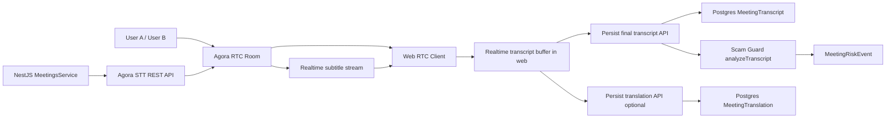

# Meeting Realtime ASR + Translation Design

## Mục tiêu

Thiết kế hoàn chỉnh cho meeting room dùng Agora để:

1. gọi voice/video realtime
2. nhận ASR realtime và hiển thị trực tiếp trong khối transcript
3. hỗ trợ translation realtime nếu Agora STT translation hoạt động ổn định
4. fallback về ASR-only nếu translation không khả dụng hoặc lỗi
5. đẩy transcript final vào pipeline Scam Guard / risk detection / evidence

Tài liệu này bám theo hiện trạng code của repo tại ngày 2026-06-21.

---

## Kết luận hiện trạng

### Đã có

- RTC panel web đã join Agora room và publish mic/cam.
- Backend đã có Agora RTC token generation cho người dùng vào room.
- Prisma đã có đầy đủ model:
  - `MeetingSession`
  - `MeetingParticipant`
  - `MeetingInvite`
  - `MeetingTranscript`
  - `MeetingTranslation`
  - `MeetingRiskEvent`
- Backend đã có ingest transcript thủ công qua `POST /meetings/:id/transcripts`.
- Transcript final hiện đã có thể sinh `MeetingRiskEvent` qua `analyzeTranscript(...)`.
- Web đã có khối `Live transcript` và feed transcript/risk events.

### Chưa có hoặc đang dở

- STT route đã khai báo nhưng service chưa implement:
  - `GET /meetings/:id/stt`
  - `POST /meetings/:id/stt/start`
  - `POST /meetings/:id/stt/stop`
- Frontend chưa lắng nghe subtitle/data stream từ Agora.
- Chưa có pipeline decode payload subtitle JSON/gzip từ Agora.
- Chưa có trạng thái partial transcript realtime riêng.
- Chưa có persist tự động cho translation realtime.
- Chưa có cơ chế fallback translation -> ASR-only.
- Chưa có env/auth dành riêng cho Agora Real-Time STT REST.

### Kết luận thật

Meeting module hiện mới ở trạng thái:

- `RTC call`: đã có khung chạy thật
- `Realtime transcript`: chưa hoàn thiện
- `Realtime translation`: chưa có thực thi hoàn chỉnh
- `Scam Guard from realtime transcript`: mới hoạt động qua transcript ingest, chưa nối trực tiếp từ Agora realtime

---

## Phạm vi thiết kế

Thiết kế này chỉ tập trung vào:

1. backend orchestration cho Agora Real-Time STT
2. frontend nhận subtitle và render realtime
3. persist transcript/translation/risk events
4. fallback an toàn

Không mở rộng sang:

- full speech-to-speech translation audio output
- Groq TTS live dubbing
- AI conversational observer
- multi-room moderation
- cloud recording

Các phần đó nên là wave sau.

---

## Cơ sở kỹ thuật từ Agora

Theo docs chính thức của Agora:

- Real-Time STT dùng REST API v7 để `join`, `leave`, `list`, `update`
- STT agent push subtitle trở lại channel
- có thể bật `enableJsonProtocol`
- khi bật JSON protocol, payload subtitle được nén gzip
- có hỗ trợ translation realtime qua `translateConfig`
- translation hiện nên xem là tính năng có rủi ro cao hơn ASR vì độ ổn định và giới hạn cấu hình

Hệ quả thiết kế:

1. Backend phải là nơi start/stop STT agent
2. Frontend không gọi thẳng REST STT của Agora
3. Frontend phải nghe data stream/subtitle stream từ Agora RTC client
4. Translation phải là optional enhancement, không phải dependency cứng của transcript pipeline

---

## Kiến trúc đề xuất



---

## Luồng nghiệp vụ chuẩn

### Luồng 1: vào meeting room

1. User mở trang meeting
2. Web lấy meeting detail
3. Web lấy Agora RTC token thường
4. `MeetingRtcPanel` join room
5. Khi room đã connected, UI cho phép bật `Live captions`

### Luồng 2: bật realtime ASR

1. User bấm `Bật transcript realtime`
2. Web gọi `POST /meetings/:id/stt/start`
3. Backend xác thực:
   - user là participant hợp lệ
   - meeting chưa kết thúc
   - Agora STT credentials đầy đủ
4. Backend start STT agent cho channel của meeting
5. Agora STT bot join room, subscribe audio, push subtitle về channel
6. Frontend nhận subtitle event và hiển thị realtime

### Luồng 3: transcript final

1. Frontend nhận các chunk partial/final
2. Partial chỉ render tạm thời trong khối transcript
3. Khi chunk final đến:
   - persist `MeetingTranscript`
   - nếu có translation thì persist `MeetingTranslation`
4. Backend sau khi lưu transcript sẽ chạy Scam Guard
5. Nếu có hit:
   - sinh `MeetingRiskEvent`
   - risk feed cập nhật

### Luồng 4: translation fail

1. User bật translation
2. Backend thử start STT với `translateConfig`
3. Nếu Agora từ chối hoặc service lỗi:
   - log warning
   - retry STT với ASR-only
   - trả về cờ `fallbackToAsrOnly = true`
4. UI hiển thị trạng thái:
   - transcript vẫn chạy
   - translation tạm không khả dụng

### Luồng 5: tắt transcript realtime

1. User bấm `Tắt transcript realtime`
2. Web gọi `POST /meetings/:id/stt/stop`
3. Backend stop agent nếu đang chạy
4. UI chuyển trạng thái về idle

---

## Thiết kế backend

## 1. Biến môi trường

Thêm:

```env
AGORA_CUSTOMER_ID=
AGORA_CUSTOMER_SECRET=
```

Ghi chú:

- `AGORA_APP_ID` và `AGORA_APP_CERTIFICATE` dùng để tạo RTC token cho user/bot
- `AGORA_CUSTOMER_ID` và `AGORA_CUSTOMER_SECRET` dùng để gọi REST Real-Time STT
- nếu dùng auth bằng RTC token cho REST STT thì vẫn nên giữ thiết kế backend-only trước, để đơn giản hóa bảo mật

## 2. DTO

File hiện có `apps/api/src/meetings/dto/stt.dto.ts` là đúng hướng. Có thể giữ:

- `languages`
- `targetLanguages`
- `maxIdleTime`
- `subscribeAudioUids`
- `enableTranslation`

Nên bổ sung thêm sau nếu cần:

- `persistTranslations?: boolean`
- `providerMode?: 'agora' | 'asr_only'`

## 3. Service methods cần có

Trong `MeetingsService` cần thêm:

- `getSttState(sessionId: string)`
- `startSttAgent(sessionId: string, walletAddress: string, dto: StartMeetingSttDto)`
- `stopSttAgent(sessionId: string, walletAddress: string)`

Helper methods:

- `ensureMeetingExists(sessionId)`
- `ensureActiveParticipant(sessionId, walletAddress)`
- `hasSttCredentials()`
- `getAgoraSttAuthHeader()`
- `findRunningSttAgent(sessionId)`
- `buildSttAgentName(sessionId)`
- `getSttPusherUid(sessionId)`
- `callAgoraSttJoin(...)`
- `callAgoraSttLeave(...)`
- `callAgoraSttList(...)`

## 4. Không lưu `agent_id` vào DB ở wave này

Đề xuất hiện tại:

- không sửa Prisma schema để thêm cột `sttAgentId`
- thay vào đó query agent đang chạy từ Agora `list agents`

Lý do:

1. tránh migration mới chỉ để phục vụ integration state tạm thời
2. giảm blast radius
3. đủ dùng cho MVP

Tradeoff:

- mỗi lần check state phải query Agora
- khó audit lịch sử agent sâu hơn

Kết luận:

- phù hợp cho giai đoạn hiện tại

## 5. Payload start STT đề xuất

```json
{
  "name": "meeting-stt-{sessionId}",
  "languages": ["vi-VN", "en-US"],
  "maxIdleTime": 300,
  "rtcConfig": {
    "channelName": "{meetingId}",
    "pubBotUid": "{deterministicBotUid}",
    "pubBotToken": "{rtcTokenForBot}",
    "subscribeAudioUids": ["all"],
    "enableJsonProtocol": true
  },
  "translateConfig": {
    "languages": [
      {
        "source": "vi-VN",
        "target": ["en-US"]
      }
    ]
  }
}
```

Ghi chú:

- nếu `enableTranslation = false` thì bỏ hẳn `translateConfig`
- nếu source language là mixed nhiều ngôn ngữ, translation config phải cẩn thận hơn
- giai đoạn đầu nên mặc định:
  - `languages = ['vi-VN', 'en-US']`
  - translation chỉ bật khi user yêu cầu

## 6. Chuẩn hóa bot UID

STT bot cần một `pubBotUid` riêng, không trùng user trong room.

Đề xuất:

- tạo UID số nguyên dương, ổn định theo `meetingId`
- luôn giới hạn trong `uint32`
- không dùng timestamp milliseconds trực tiếp

Lý do:

- trước đó hệ thống đã từng gặp lỗi overflow với Agora token do giá trị vượt quá `4294967295`

## 7. Response shape cho STT state

Đề xuất backend trả:

```ts
interface MeetingSttState {
  enabled: boolean;
  status: 'idle' | 'starting' | 'running' | 'fallback_asr_only' | 'stopping' | 'error';
  agentId: string | null;
  mode: 'asr_only' | 'asr_translate';
  languages: string[];
  targetLanguages: string[];
  pusherUid: number | null;
  fallbackReason?: string | null;
}
```

## 8. Persist transcript

Không persist partial chunk vào DB.

Chỉ persist khi:

- câu đã final
- hoặc chunk đủ ổn định và đạt ngưỡng xác nhận

Lý do:

1. tránh spam DB
2. tránh transcript feed bị lặp
3. giảm risk event giả do partial text

## 9. Translation persistence

Khi nhận final transcript:

- tạo `MeetingTranscript`
- nếu có translated text:
  - tạo `MeetingTranslation`
  - gắn bằng `transcriptId`

Provider nên lưu:

- `provider = 'agora-stt'`

Nếu sau này fallback dùng AI translation nội bộ:

- `provider = 'groq'` hoặc `provider = 'internal-ai'`

---

## Thiết kế frontend

## 1. Hook API cần bổ sung

Trong `apps/web/hooks/use-api.ts`:

- `useMeetingSttState(meetingId, enabled?)`
- `useStartMeetingStt(meetingId)`
- `useStopMeetingStt(meetingId)`
- `useAddMeetingTranslation(meetingId)`

Invalidate query:

- `meeting-transcripts`
- `meeting-risk-events`
- `meeting`
- `meeting-stt-state`

## 2. Runtime state trên trang meeting

Trang `apps/web/app/meetings/[id]/page.tsx` cần thêm local state:

- `sttLanguages`
- `sttTargetLanguages`
- `translationEnabled`
- `realtimeEntries`
- `realtimeError`
- `realtimeSuccess`

### `realtimeEntries` nên tách khỏi persisted transcripts

Đề xuất shape:

```ts
interface LiveTranscriptEntry {
  id: string;
  speakerUid?: string | number | null;
  speakerLabel: string;
  text: string;
  language: string;
  translatedText?: string | null;
  targetLanguage?: string | null;
  startTime?: number | null;
  endTime?: number | null;
  isFinal: boolean;
  updatedAt: number;
}
```

Mục đích:

- partial captions hiện ngay lập tức
- final captions sau đó đồng bộ vào DB feed

## 3. `MeetingRtcPanel` phải nhận callback transcript

Đề xuất mở rộng props:

```ts
onRealtimeTranscript?: (chunk: RealtimeAgoraTranscriptChunk) => void;
sttPusherUid?: number | null;
```

`MeetingRtcPanel` sẽ:

1. join room như hiện tại
2. gắn listener `stream-message`
3. lọc đúng `remoteUid === sttPusherUid`
4. decode payload subtitle
5. bắn callback về page

## 4. Decode subtitle payload

Nên tách thành helper riêng:

- `apps/web/lib/agora-stt.ts`

Hàm đề xuất:

- `decodeAgoraSttJsonPayload(payload: Uint8Array)`
- `normalizeAgoraSttMessage(raw)`
- `getAgoraSttPusherUid(meetingId: string)`

Payload khi bật `enableJsonProtocol` cần:

1. gunzip
2. parse JSON
3. map sang shape nội bộ

## 5. UI transcript realtime

Khối `Live transcript` nên chia 2 lớp:

### Lớp 1: Realtime in-progress

- hiển thị partial caption đang chạy
- update theo từng subtitle event
- style khác persisted transcript

### Lớp 2: Persisted transcript feed

- hiển thị transcript final đã lưu DB
- hiển thị translation dưới transcript nếu có
- hiển thị risk signal liên quan nếu backend đã sinh

## 6. Trạng thái UI đề xuất

- `idle`: chưa bật transcript
- `starting`: đang bật STT
- `running`: transcript đang nhận bình thường
- `fallback_asr_only`: chỉ có transcript gốc, translation tắt
- `error`: lỗi
- `stopping`: đang tắt

Thông báo UI chỉ cần mức ngắn gọn:

- thành công
- cảnh báo
- lỗi

Không hiển thị raw logs.

---

## Chuẩn xử lý transcript realtime

## 1. Quy tắc partial

Partial chunk:

- chỉ hiện trên UI
- không lưu DB
- không chạy Scam Guard

## 2. Quy tắc final

Final chunk:

- merge/chuẩn hóa text
- lưu `MeetingTranscript`
- nếu có translation thì lưu `MeetingTranslation`
- backend chạy `analyzeTranscript`

## 3. Dedup

Cần chống lặp final transcript bằng một trong các cách:

- sentence id từ Agora
- hash của `(speaker + startTime + content)`
- cache cục bộ trong phiên

Khuyến nghị:

- frontend chống duplicate trước
- backend vẫn nên chịu được duplicate ở mức hợp lý

## 4. Speaker attribution

Agora subtitle có thể không map thẳng ra wallet.

Vì vậy giai đoạn đầu:

- dùng `speakerUid`
- map tạm sang:
  - participant có `agoraUid` nếu đã biết
  - fallback `uid {x}`

Wave sau mới nên nâng cấp:

- đồng bộ `MeetingParticipant.agoraUid`
- map chính xác sang buyer/seller/guest

---

## Tích hợp Scam Guard

Pipeline mong muốn:

1. final transcript vào backend
2. backend lưu transcript
3. backend chạy `analyzeTranscript(content, dealStatus)`
4. nếu có hit:
   - lưu `MeetingRiskEvent`
5. web refresh risk feed

Giai đoạn này chưa cần:

- realtime risk trên từng partial word
- live block action dựa trên partial ASR

Lý do:

- false positive cao
- text partial rất nhiễu

---

## Translation strategy

## Phương án A: Agora translation là primary, ASR-only là fallback

### Ưu điểm

- ít độ trễ hơn khi Agora xử lý trọn gói
- bớt phụ thuộc thêm provider

### Nhược điểm

- translation là Beta
- behavior có thể thay đổi theo project/app config

### Khuyến nghị

- đây là phương án nên dùng hiện tại

## Phương án B: Agora chỉ ASR, translation do backend AI làm sau

### Ưu điểm

- kiểm soát tốt hơn
- dễ thay provider

### Nhược điểm

- độ trễ cao hơn
- tốn token/cost
- phức tạp hơn cho realtime

### Kết luận

- chỉ nên dùng như fallback wave sau

## Quyết định đề xuất

Wave hiện tại:

1. thử `Agora ASR + translation`
2. nếu lỗi thì fallback `Agora ASR-only`
3. chưa thêm AI translation backend realtime ngay

---

## API contract đề xuất

## `GET /meetings/:id/stt`

Response:

```json
{
  "enabled": true,
  "status": "running",
  "agentId": "agent_xxx",
  "mode": "asr_translate",
  "languages": ["vi-VN", "en-US"],
  "targetLanguages": ["en-US"],
  "pusherUid": 384521,
  "fallbackReason": null
}
```

## `POST /meetings/:id/stt/start`

Request:

```json
{
  "languages": ["vi-VN", "en-US"],
  "targetLanguages": ["en-US"],
  "enableTranslation": true,
  "maxIdleTime": 300,
  "subscribeAudioUids": ["all"]
}
```

Response:

```json
{
  "enabled": true,
  "status": "running",
  "agentId": "agent_xxx",
  "mode": "asr_translate",
  "languages": ["vi-VN", "en-US"],
  "targetLanguages": ["en-US"],
  "pusherUid": 384521,
  "fallbackReason": null
}
```

Fallback response:

```json
{
  "enabled": true,
  "status": "fallback_asr_only",
  "agentId": "agent_xxx",
  "mode": "asr_only",
  "languages": ["vi-VN", "en-US"],
  "targetLanguages": [],
  "pusherUid": 384521,
  "fallbackReason": "Agora translation unavailable. Running ASR only."
}
```

## `POST /meetings/:id/stt/stop`

Response:

```json
{
  "enabled": false,
  "status": "idle",
  "agentId": null,
  "mode": "asr_only",
  "languages": [],
  "targetLanguages": [],
  "pusherUid": null,
  "fallbackReason": null
}
```

---

## Rủi ro kỹ thuật

## 1. Auth STT REST

Rủi ro:

- thiếu `AGORA_CUSTOMER_ID` / `AGORA_CUSTOMER_SECRET`
- hoặc app chưa bật Real-Time STT trong Agora Console

Hệ quả:

- start agent fail

Giảm thiểu:

- backend preflight check
- message lỗi rõ ràng

## 2. Payload format từ Agora

Rủi ro:

- JSON protocol và actual payload format có thể khác dự kiến

Giảm thiểu:

- isolate parser trong `agora-stt.ts`
- log parser error ở dev
- không làm crash RTC room

## 3. Duplicate transcript

Rủi ro:

- final event lặp

Giảm thiểu:

- local dedup key
- backend tolerance

## 4. Translation beta không ổn định

Rủi ro:

- start translation fail
- output translation không đều

Giảm thiểu:

- fallback ASR-only
- UI báo rõ trạng thái

## 5. Speaker mapping không chuẩn

Rủi ro:

- transcript hiện `uid` thay vì buyer/seller

Giảm thiểu:

- wave này chấp nhận mapping tạm
- wave sau sync `agoraUid` với participant

---

## Thứ tự triển khai khuyến nghị

## Phase 1: backend STT orchestration

1. implement service methods STT
2. thêm env
3. typecheck API pass
4. test start/stop state bằng request thật

## Phase 2: frontend subtitle ingest

1. thêm hooks STT
2. thêm parser `agora-stt.ts`
3. nối `stream-message` trong `MeetingRtcPanel`
4. render partial transcript realtime

## Phase 3: persist final transcript

1. persist final transcript
2. persist translation nếu có
3. xác minh risk event tự sinh

## Phase 4: polish UX

1. nút start/stop transcript realtime
2. alert trạng thái gọn
3. bỏ vai trò manual ingest khỏi flow chính

---

## Tiêu chí hoàn thành

Module được xem là hoàn thiện ở wave này khi đạt đủ:

1. User vào room và gọi RTC bình thường
2. Bật `transcript realtime` thành công
3. Partial transcript xuất hiện trực tiếp trên web
4. Final transcript được lưu vào DB
5. Nếu translation bật và Agora hỗ trợ:
   - translation hiển thị dưới transcript
   - được persist vào `MeetingTranslation`
6. Nếu translation không chạy:
   - transcript gốc vẫn chạy
   - UI báo `ASR-only`
7. Risk events vẫn được sinh từ transcript final
8. Không cần nhập tay transcript để demo meeting pipeline nữa

---

## Khuyến nghị chốt

Hướng nên làm ngay:

1. hoàn thiện backend `STT start/stop/state`
2. dùng Agora `enableJsonProtocol`
3. render realtime transcript qua `stream-message`
4. persist chỉ transcript final
5. coi translation là optional beta enhancement
6. fallback sạch sang ASR-only

Đây là hướng ít rủi ro nhất, sát thiết kế hiện tại nhất, và đủ để biến meeting room từ `pre-RTC transcript mock` sang `meeting có transcript realtime chạy thật`.
